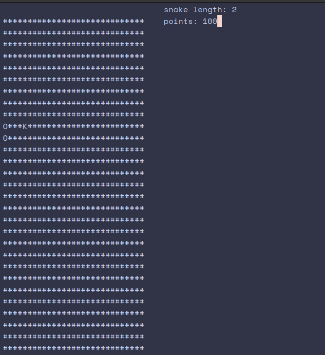

# snake game written in rust
Terminal output is handled using the crate "termion" \
As of now I don't know how to read documenation very well, so my usage of this crate was based on this project: https://github.com/SmailBarkouch/rust-cli-breakout \

